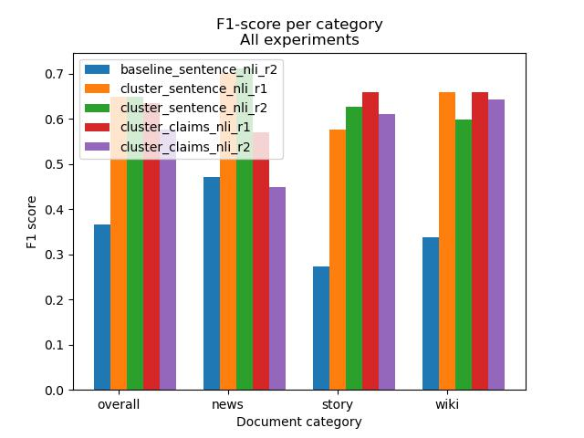

# Semantic Clustering for Contradiction Detection using Claim Extraction

Automatic detection of document-level contradictions using automated claim-extraction and NLI models. 

### Results

Our best model achieves a F1-score of **0.649** (ROC-AUC 0.670) on the ContraDoc benchmark (Li et al. 2023). This is a significant improvement over the original results published by Li et al, which achieved a F1-score of **0.437**.



### Requirements

Tested with Python `3.12`. Run the following to create the environment:

```
python3.12 -m venv .venv
source .venv/bin/activate
pip install --upgrade pip
pip install -r requirements.txt
```

Run the following command to download the required NLTK resources:
```
python -m spacy download en_core_web_sm
```

### Environment variables (.env)

To run the claim extraction model, the used LLM can be configured using environment file. This is not needed for running the model with pre-extracted claims.

Create a `.env` file from the example:

```bash
cp .env.example .env
```

Then edit `.env` and set at least the keys you need:

- `HF_TOKEN`: Hugging Face token for faster model downloads and higher rate limits (recommended for local models).
- `OPENAI_API_KEY`: required when using the `remote` backend.

### Claim Extractor configuration

You can change model names directly in `.env`:

- `CLAIM_MODEL_1`: local model run 1
- `CLAIM_MODEL_2`: local model run 2
- `CLAIM_MODEL_REMOTE`: remote model

Examples are in `.env.example`.

Optionally run the smoke test:

```bash
python scripts/smoke_test_claim_extractor.py
```

## Running the model

Run the notebook `ContraDetect.ipynb` to run the model. This will load the ContraDoc dataset (from the `dataset/ContraDoc` folder) and run the model on each example in the dataset. 

### Configuration

The notebook contains various configuration parameters listed in the cell with the "Configuration" header. The most important ones to configure the experiment are listed below:

```python
# Mode for claim detection: 'claims' to detect using extracted claims, 'sentences' to detect using (cleaned) sentences.
DETECT_MODE = 'claims'

# Whether to cluster claims based on semantic similarity before contradiction detection.
# If this is False, only individual claims will be checked for contradictions, likely missing a lot of positives
CLUSTER_CLAIMS = True

# Folder to load pre-extracted claims from (if EXTRACT_MISSING_CLAIMS is False, this will be the only source of claims)
CLAIMS_INPUT_DIR = './extracted_claims/pass_01_initial_claim_extraction'

# Whether to extract missing claims from the original text (if False, only the pre-extracted claims will be used)
EXTRACT_MISSING_CLAIMS = False 

# Whether to retest positive detections with a prefix that aims to reduce false positives due to missing temporal 
# information in the claim cluster.
APPLY_TEMPORAL_PREFIX = True
```


### Collecting experiment results

Before running, make sure to update the `experiment_id` variable to a unique identifier. Results will be written to `data/results.{experiment_id}.json`.

If the `resume` variable is set to `True`, the results file matching the experiment id will be loaded before starting. This way, examples that have already been tested won't be retested, and interrupted runs can be resumed later.

### Data analysis

To generate summaries and graphs of the experiment results, use the `DataAnalysis.ipynb` notebook. This will read the data files from `data/results.{experiment_id}.json` and generates graphs and latex tables in the `data/{experiment_id}/` folder. It will also generate some aggregated overview between selected experiments, and write the results to `data/combined/`.

Detailed results are generated only for the `experiment_id` defined below the "Individual results" header.

## Attribution

- This model is tested against the [ContraDoc dataset](https://github.com/ddhruvkr/contradoc) (Li et al. 2023).
- Semantic sentence embeddings are calculated using the Sentence-BERT model (Reimers, Nils and Gurevych, Iryna 2019). Their pre-trained [`sentence-transformers/all-MiniLM-L6-v2`](https://huggingface.co/sentence-transformers/all-MiniLM-L6-v2) model is used.
- Contradiction detection is performed using a DeBERTaV3 model (He, Gao, Chen 2021). The specific fine-tuned model currently used is [`MoritzLaurer/DeBERTa-v3-large-mnli-fever-anli-ling-wanli`](https://huggingface.co/MoritzLaurer/DeBERTa-v3-large-mnli-fever-anli-ling-wanli)
